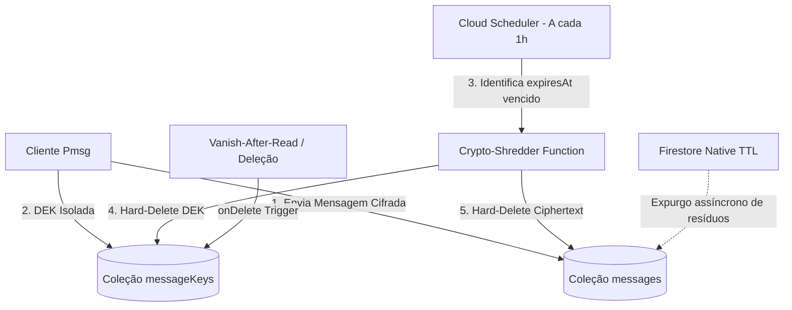

<div align="center">
  <h1>🔒 Pmsg - Zero-Trace Ephemeral Secure Messaging</h1>
  <p><strong>Aplicativo Android de Mensagens Ultrasseguras com Autodestruição em 24h, Criptografia AES-256-GCM em Hardware e Zero Rastro.</strong></p>
</div>

---

## 🌟 Visão Geral

O **Pmsg** foi desenvolvido com um objetivo claro: **garantir privacidade absoluta e zero rastros** no dispositivo e em trânsito.

### 🛡️ Pilares de Segurança

1. **Criptografia em Hardware (TEE / StrongBox)**:
   - Criptografia autenticada **AES-256-GCM** com IV aleatório de 12 bytes gerado via `SecureRandom` para cada payload.
   - Chave mestre gerenciada com segurança no **AndroidKeyStore** com isolamento de hardware (TEE / StrongBox).
   - **Fail-Closed Security**: Se houver qualquer inconsistência criptográfica, os dados em texto plano nunca são gravados no disco.

2. **Zero Rastro e Autodestruição (TTL Estrito de 24h)**:
   - Todas as mensagens possuem expiração máxima estrita de **24 horas** (ou presets personalizados: 30s, 1m, 5m, 1h, 6h, 12h, 24h).
   - Limpeza em tempo real no banco Room + **WorkManager** em segundo plano a cada 15 minutos para expurgação automática definitiva.
   - **Multi-pass Shredding**: Sobrescrita de payload com ruído criptográfico antes da exclusão de registros.

3. **Incineração de Pânico (Panic Wipe & Crypto-Shredding)**:
   - Destruição instantânea de todas as salas, mensagens e mídias ao acionar o botão de Pânico ou via **Shake-to-Clear** (chacoalhar o celular).
   - **Crypto-Shredding**: A chave mestre do KeyStore é invalidada e purgada, tornando impossível qualquer recuperação de dados residuais na memória flash.

4. **Proteção Anti-Captura & Notificações Restritas**:
   - `FLAG_SECURE` dinâmico para impedir prints e gravações de tela.
   - Detecção em tempo real de capturas com bloqueio preventivo de visualização única.
   - Proteção de clipboard (`ClipDescription.EXTRA_IS_SENSITIVE`) no Android 13+ para impedir que teclados e históricos capturem mensagens copiadas.
   - Notificações enviadas **estritamente para novas conversas recebidas**, mantendo sigilo total em mensagens recorrentes.

5. **Bloqueio Biométrico e Rate Limiting**:
   - Bloqueio por Impressão Digital / Reconhecimento Facial com fallback estrito para PIN criptografado com Salt individual e SHA-256.
   - **Anti-Brute Force**: Bloqueio progressivo temporário (cooldown lockout) após tentativas incorretas consecutivas.
   - **Auto-Bloqueio por Inatividade**: Bloqueio automático configurável (1 min a 30 min, padrão 5 min).

6. **Backup e Extração Desativados**:
   - `android:allowBackup="false"` e regras de exclusão completas para prevenir cópia de banco via ADB ou nuvem.

---

## 🌪️ Arquitetura Zero-Trace Server-Side (Expiração Autoritativa & Crypto-Shredding)

Para mitigar ameaças em que clientes modificados ou offline tentam burlar o TTL local, o **Pmsg** implementa exclusão e destruição criptográfica autoritativa no servidor:



1. **Purge Local (Client)**:
   - Banco Room local + `WorkManager` (Android) e `ExpiredMessageCleanupScheduler` (Desktop/Web/iOS) executam sanitização contínua em memória e SQLite.
2. **Vanish-After-Read & Trigger Reativo (`onDeleteMessage`)**:
   - Quando o destinatário lê uma mensagem efêmera ou o usuário a apaga manualmente, a exclusão do documento em `messages` dispara um trigger `onDocumentDeleted` no Cloud Functions que destrói imediatamente a chave DEK correspondente em `messageKeys`.
3. **Crypto-Shredding Server-Side (`scheduledMessageShredder`)**:
   - Função agendada no Cloud Scheduler executada a cada 1 hora.
   - Realiza varredura de documentos em `messageKeys` com `expiresAt <= now` e executa *batch delete* da chave DEK e da mensagem associada.
   - **Garantia Criptográfica**: Uma vez que a DEK de 256 bits é destruída, o ciphertext torna-se matematicamente impossível de ser decifrado, mesmo que cópias residuais ainda aguardem o expurgo físico.
4. **TTL Nativo do Firestore**:
   - Política de campo TTL configurada sobre `expiresAt` na coleção de mensagens para exclusão assíncrona automática de infraestrutura.
5. **Proxy Backend de IA (`geminiProxy`)**:
   - Chamadas dos clientes Desktop e Web para geração de notas efêmeras são autenticadas por token de sessão e intermediadas por Cloud Function HTTPS.
   - A chave `GEMINI_API_KEY` reside exclusivamente no Google Cloud Secret Manager, eliminando qualquer risco de extração em binários ou tráfego de rede do cliente.

---

## 🛡️ Matriz Honesta de Garantias de Segurança por Plataforma

| Recurso / Garantia | Android (Nativo) | Desktop Windows (JVM) | iOS (CMP) | Web (WasmJS) |
|---|---|---|---|---|
| **Hardware KeyStore / TEE** | ✅ Sim (`AndroidKeyStore` StrongBox/TEE) | ⚠️ Parcial (Windows DPAPI / CNG em repouso) | ✅ Sim (`Apple Keychain` Secure Enclave) | ❌ Não (Memória volátil da aba) |
| **Bloqueio de Screenshot** | ✅ Sim (`FLAG_SECURE` impede print e gravação) | ❌ Não (Sem API de SO para bloquear terceiros) | ❌ Não (iOS **NÃO** bloqueia hardware prints) | ❌ Não (Inviável no navegador) |
| **Detecção de Screenshot** | ✅ Sim (`ScreenCaptureCallback`) | ❌ Não | ✅ Sim (`UserDidTakeScreenshotNotification`) | ❌ Não |
| **Proteção de Clipboard** | ✅ Sim (`EXTRA_IS_SENSITIVE` + Clear TTL) | ⚠️ Sim (Auto-limpeza com timer na JVM) | ⚠️ Sim (Auto-limpeza com timer local) | ⚠️ Sim (Auto-limpeza volátil) |
| **Incineração (Panic Shredding)** | ✅ Sim (Invalidação KeyStore + Overwrite) | ✅ Sim (Deleção DPAPI + Overwrite de memória) | ✅ Sim (Deleção Keychain + Overwrite) | ⚠️ Sim (Limpeza de memória volátil) |
| **Integridade (App Check)** | ✅ Sim (Play Integrity API nativo) | ⚠️ Sim (Token de Sessão via Proxy Backend) | ✅ Sim (DeviceCheck / App Attest nativo) | ⚠️ Sim (reCAPTCHA Enterprise / Proxy) |
| **Origem da API Key Gemini** | 🛡️ Server-Side (Firebase Secret Manager) | 🛡️ Server-Side (Proxy Backend HTTPS) | 🛡️ Server-Side (Firebase Secret Manager) | 🛡️ Server-Side (Proxy Backend HTTPS) |

---

## 🚀 Como Executar Localmente

### Pré-requisitos
- [Android Studio Ladybug / Meerkat ou superior](https://developer.android.com/studio)
- Android SDK (API 24+ / Compile SDK 36)
- JDK 17 ou 21

### Passo a Passo

1. Abra o **Android Studio**.
2. Clique em **Open** e selecione o diretório deste repositório (`Pmsg`).
3. Aguarde o Gradle sincronizar as dependências e o KSP processar os DAOs do Room.
4. (Opcional) Copie `.env.example` para `.env` caso utilize serviços externos.
5. Execute em um emulador ou dispositivo físico com Android 7.0+ (API 24+).

---

## 🧪 Testes Unitários

O projeto inclui suíte de testes unitários para verificação criptográfica:
- `CryptoManagerTest`: Testes de integridade de encriptação, fail-safe, detecção de corrupção e Crypto-Shredding.
- `EphemeralMessageCommonTest`: Testes de cálculo de TTL, auto-desaparecimento após leitura e trituração de mensagens.
- `ExampleRobolectricTest`: Testes de integração de serviços em segundo plano e workers de limpeza.

---

## ⚡ Desenvolvimento & Compose Hot Reload (Antigravity IDE / Desktop)

### Fluxo de Trabalho Diário
1. No terminal integrado ou através das tarefas do VS Code (`Ctrl+Shift+P` > `Tasks: Run Task`), execute:
   ```powershell
   .\gradlew.bat :composeApp:hotRunDesktop --autoReload
   ```
2. A janela do aplicativo abrirá com `alwaysOnTop = true` e o título `Pmsg [desktop-dev]`, mantendo-se sempre visível durante o desenvolvimento.
3. Edite o código da interface em `commonMain` ou `desktopMain` e salve (`Ctrl+S`): as alterações serão refletidas instantaneamente no aplicativo em execução, **sem reiniciar o processo**.

### Servidor MCP (`compose-hot-reload`)
O servidor Model Context Protocol integrado permite a automação e inspeção da interface via AI Agent. Ferramentas disponíveis:
- `status`: Verifica o status atual da aplicação e do servidor de hot reload.
- `reload`: Dispara o hot reload forçado dos componentes atualizados.
- `await_reload`: Aguarda a finalização do ciclo de recompilação e injeção do reload.
- `take_screenshot`: Captura a tela atual da janela do aplicativo desktop.
- `get_semantic_tree`: Inspeciona a árvore de nós semânticos e acessibilidade da UI Compose.
- `get_logs`: Obtém os logs de runtime do aplicativo Compose Desktop.
- `click`: Simula cliques em elementos interativos da interface.
- `type_text`: Simula digitação de texto em campos selecionados.
- `scroll`: Realiza rolagem programática em listas e containers.
- `list_windows`: Lista as janelas ativas da aplicação.
- `get_ui_error`: Retorna eventuais exceções e erros de renderização em tempo real.
- `restart`: Reinicia o processo da aplicação desktop quando necessário.

---

## 📄 Licença

Desenvolvido para segurança e privacidade estrita. Zero Trace.
