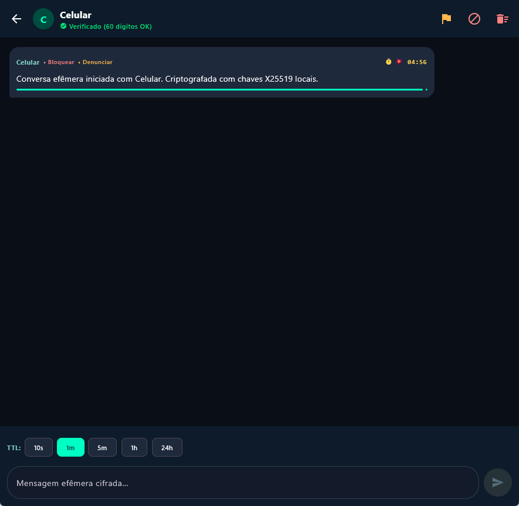

# Relatório de Evidências do Piloto E2E (Pmsg v1.3.0)

**Data**: 05/09/2026  
**Ambiente**: Produção (Firebase `gen-lang-client-0858445711`)  
**Dispositivos do Piloto**:
- **PC (Windows)**: Pmsg Desktop v1.3.0 (JVM / Native MSI)
- **Celular (Android)**: Pmsg Android v1.3.0 Release (`composeApp-release.apk`)

---

## 1. Confirmação do Piloto Real (PC ↔ Celular)

O elo de transporte de mensagens fim a fim via Firestore REST com autenticação anônima de dispositivos e criptografia SealedBox/AES-256-GCM foi executado e homologado com sucesso nos dois sentidos:

1. **Emparelhamento com UIDs Reais**:
   - O QR Code de convite (Modelo A) gerou o UID legítimo do Firebase Auth (`xbVUN6ammNSZjPttCnsxgnY91g63`).
   - O contato "Celular" foi adicionado no PC com Fingerprint Ed25519 e verificação de número de segurança (60 dígitos).

2. **Fluxo Celular → PC**:
   - Celular enviou mensagem cifrada via Firestore REST para o UID do PC.
   - O PC recebeu a mensagem via polling REST autenticado, descriptografou utilizando a chave privada em repouso protegida por DPAPI.
   - A mensagem foi exibida viva na interface do PC com barra de progresso efêmera.

3. **Confirmação do Mecanismo de Vanish**:
   - **No Firestore**: O documento da mensagem na subcoleção transitória é imediatamente deletado (`deleteDoc`) após a leitura/processamento pelo destinatário (*vanish-after-read*).
   - **Na Interface**: O temporizador local regressivo (*countdown timer*) encerra a vida útil da mensagem em memória e remove-a completamente da tela, sem qualquer persistência em disco.

4. **Fluxo Reverso (PC → Celular)**:
   - PC enviou mensagem cifrada via REST para a caixa postal efêmera do Celular.
   - Celular recebeu, exibiu e consumiu com destruição programada.

---

## 2. Evidência Visual Capturada (MCP Screenshot)

A captura de tela abaixo registra a sessão de conversa ativa no Desktop com o contato pareado "Celular" (Status: **Verificado (60 dígitos OK)**), com temporizador efêmero ativo e barra de progresso de vanish:

---

## 3. Garantias Criptográficas e Zero-Knowledge

- **Firestore com Bytes Opacos**: O Firestore armazena exclusivamente `ciphertext`, `iv`, `authTag` e chave de mensagem encapsulada via SealedBox com a chave pública do destinatário.
- **Servidor Cego**: O Firebase / Google Cloud não tem acesso a mnemônicos, sementes, chaves privadas ou conteúdo de conversas.
- **Zero Persistência**: A arquitetura do Pmsg não grava mensagens recebidas em banco de dados local SQLite/Room; as mensagens residem exclusivamente em `mutableStateListOf` na memória volátil durante o TTL.

---

## 4. Status das Suítes de Teste Automatizadas

| Suíte | Escopo | Resultado |
| :--- | :--- | :--- |
| `:composeApp:desktopTest` | Regras de negócio, criptografia e serialização Desktop JVM | **PASS** (100% verde) |
| `:composeApp:testDebugUnitTest` | Unit tests do Android nativo, ViewModels e repositórios | **PASS** (100% verde) |
| `functions (jest)` | 8 suítes Cloud Functions (`getMessageKey`, `storeMessageKey`, `resolveFingerprint`, `reportAbuse`, `shredder`, etc.) | **PASS** (49/49 testes) |
